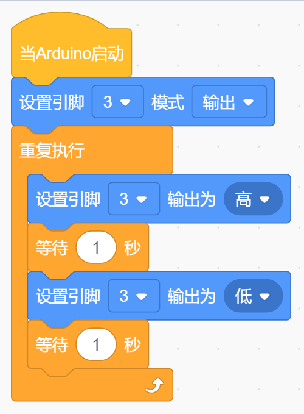

# KidsBlock

## 1. KidsBlock简介  

KidsBlock是一款基于图形化编程的学习平台，旨在帮助儿童和初学者通过直观且易于理解的可视化界面学习编程和电子学的基本概念。通过简单的拖放操作，用户可以轻松创建互动项目，使用各种传感器和执行器。KidsBlock不仅支持Arduino硬件，还能让孩子们在学习中培养创造力和解决问题的能力。该平台提供了丰富的教程和项目示例，适合各个年龄段的学习者。  

## 2. 接线图  

  

## 3. 测试代码  

  

## 4. 代码说明  

1. 我们找到并设置了所需模块，通过控制模块拖出一个延时模块，默认延时1秒。   

2. 在代码中，首先设置引脚3为输出模式，连接的模块信号端接到D3并设置为高电平以打开激光头。接下来，添加延时1秒，使激光头保持打开状态。随后，代码将通过设置低电平来关闭激光头，并再延时1秒。这样设置确保激光头将按照打开1秒、关闭1秒的节奏循环执行。  

## 5. 测试结果  

在按照接线图连接好线路并烧录好代码后，上电后激光头将顺序交替打开1秒和关闭1秒，形成一个循环。

