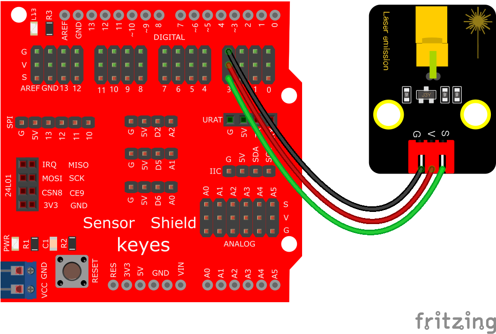
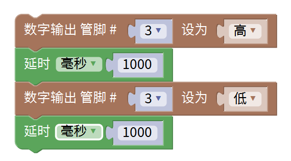

# Mixly

## 1. Mixly简介  

Mixly是一款基于图形化编程的教育平台，旨在帮助初学者和儿童通过简单、直观的界面学习编程的基本概念。它允许用户使用拖放式的操作来创建Arduino项目，同时支持Scratch和Arduino C语言。Mixly为学习者提供了丰富的模块和组件，适用于多种电子项目，使用户在轻松的环境中探索和创造。该平台还提供了大量的教程和示例，有助于提升学习者的实践能力和创造力。  

## 2. 接线图  

  

## 3. 测试代码（测试软件版本：Mixly 1.2.0）  

  

## 4. 代码说明  

1. 我们从Mixly软件的输入/输出模块中找到并设置了相关组件。  

2. 从“控制”模块中找到并拖出延时模块，设置1000为延时的毫秒数，代表延迟1000毫秒（即1秒）。  

3. 在代码中，首先设置引脚D3为输出模式，将模块信号端连接到D3，并设置为高电平，以打开激光头。接下来的延时1000毫秒将激光头保持打开状态1秒；之后设置低电平来关闭激光头，再延时1秒。此代码将形成一个循环，每隔1秒打开和关闭激光头。  

## 5. 测试结果  

按照接线图连接好线路并烧录代码，上电后，激光头将以1秒为周期，交替打开和关闭。

