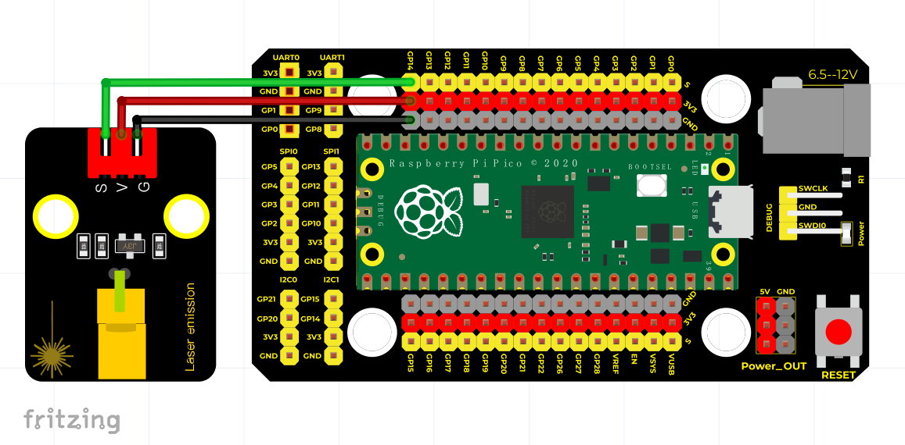

# Python


## 1. Python简介  

Python是一种广泛使用的高级编程语言，以其简单易懂的语法和强大的功能而著称。Python的设计理念强调代码的可读性和简洁的语法，使得程序员能够用更少的代码实现更多的功能。它支持多种编程范式，包括面向对象、命令式和函数式编程。Python在数据分析、人工智能、网络开发、科学计算、自动化等多个领域具有广泛的应用。由于其强大的库和框架（如NumPy、Pandas、TensorFlow和Django等），Python成为了初学者和专业开发者的理想选择。  

## 2. 接线图  

  

## 3. 测试代码（测试软件版本：Thonny）  

```python  
import machine  
import utime  

external = machine.Pin(14, machine.Pin.OUT) # 设置GPIO14为输出  

while True:  
    external.value(1) # 打开激光头  
    utime.sleep(1) # 延时1秒  
    external.value(0) # 关闭激光头  
    utime.sleep(1) # 延时1秒  
```  

## 4. 代码说明  

1. 在上述代码中，我们导入了`machine`和`utime`模块，其中`machine`模块用于与硬件进行交互，而`utime`模块用于控制程序的延时。  

2. `external = machine.Pin(14, machine.Pin.OUT)`将GPIO14配置为输出模式，使得该引脚能够控制激光头。  

3. 在`while True`循环中，代码会不断执行以下操作：  
   - `external.value(1)`将引脚设置为高电平，激活激光头。  
   - `utime.sleep(1)`使程序暂停1秒，确保激光头保持开启状态1秒。  
   - `external.value(0)`将引脚设置为低电平，关闭激光头。  
   - 再次调用`utime.sleep(1)`，使程序暂停1秒。  

通过这种方式，激光头会每隔1秒开启与关闭，实现了一个简单的开关控制功能。  

## 5. 测试结果  

按照接线图连接好线路并烧录代码后，上电后，激光头将每隔1秒打开一次，随后关闭，再循环交替进行。


